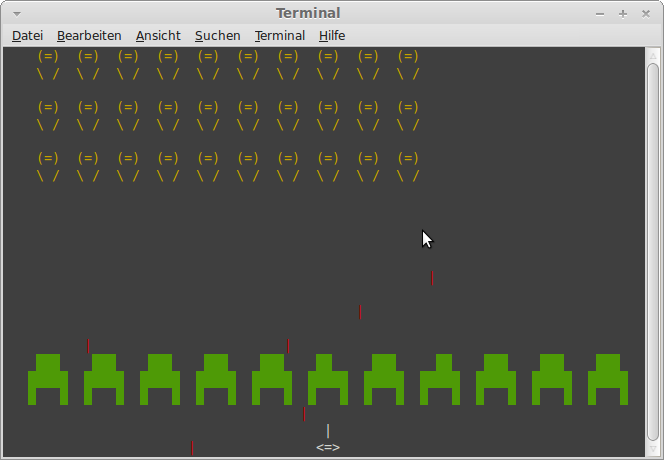

goinvaders
==========

An implementation of space invaders for the commandline written in golang.

Tested in cli using linux bash.

I took some inspiration on how to handle multiple ships from https://github.com/GeertJohan/gomatrix

### Installation
Install from source with `go get github.com/tobischo/goinvaders`

### Usage
Simply run `goinvaders` 

### License
[LICENSE](LICENSE)
